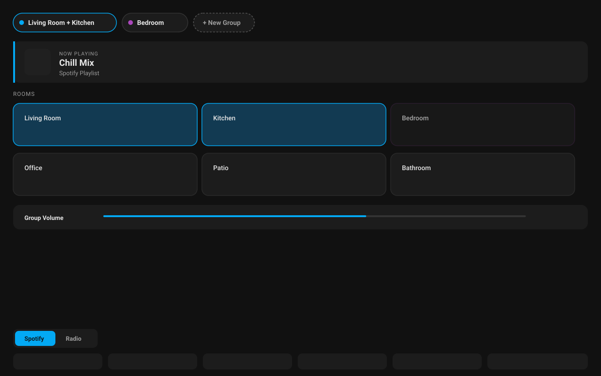

# Music Multiroom Card

A full-page Home Assistant Lovelace card for controlling whole-home audio.
Built and tested against Home Assistant's **HEOS** integration. It uses
HA's generic `media_player` join/unjoin/`play_media` services, but is not
tested against — and makes no compatibility claim for — Sonos, Bluesound,
or any other platform.



> The image above is a schematic preview drawn from the card's approved
> design, not a live screenshot yet — see the note in this repo's
> `CLAUDE.md` about swapping it for a real one once the card has been
> verified against a live HEOS system.

---

## Features

- **Multiple simultaneous groups.** Group any set of rooms and play
  something on them while a completely different group plays something
  else — an "Active Groups" strip lets you switch which group's controls
  (now playing, volume, favorites) you're looking at.
- **Tap rooms to group them.** Tap an idle room to start a new group or add
  it to the currently focused one; tap a room already in the focused group
  to remove it.
- **Group volume + per-room fine adjustment.** One slider for the whole
  group, with an expandable per-room slider that preserves relative balance
  rather than forcing every speaker to the same level.
- **Spotify + Radio favorites shelf, on two different backends.** Radio
  favorites are picked by browsing HEOS's own sources, same as always. **If
  a room has a Music Assistant entity configured**, its Spotify favorites
  are instead browsed and played through **Music Assistant** — your real
  Spotify library and account, not HEOS's own limited Spotify handling.
  Both are picked visually in the editor, no IDs or names to type in by
  hand. Grouping, volume, and transport all stay on native HEOS regardless
  of which backend a favorite plays from.
- **Built-in GUI editor**, including the browse-and-pick flow — no YAML
  required to configure the card.
- English/Swedish UI, theme-aware colors (dark and light Home Assistant
  themes both work — only the group-identity color coding is a fixed
  palette, since it needs to visually distinguish arbitrary simultaneous
  groups from each other).

## Installation

### Via HACS (recommended, once added to the default store)

Search for "Music Multiroom Card" in HACS → Frontend, install, then add the
card via the Lovelace UI ("+ Add Card" → "Music Multiroom Card") or as
`type: custom:music-multiroom-card` in YAML.

### Manual install

1. Copy `music-multiroom-card.js` to `/config/www/`.
2. Add it as a Lovelace resource: **Settings → Dashboards → Resources → Add
   Resource**, URL `/local/music-multiroom-card.js`, type **JavaScript
   Module**.

For a dedicated tablet dashboard, put this card alone on a view set to
**Panel** mode so it fills the whole screen.

## Configuration

The card has no visible options other than what you configure through its
GUI editor: your rooms (which `media_player` entities are groupable) and
your Spotify/Radio favorites, both populated by browsing rather than
typed by hand. The equivalent YAML shape (for reference — you won't
normally write `favorites` entries yourself, since `media_content_id`
values are opaque HEOS-internal identifiers the browse picker captures
for you, not something you'd type):

```yaml
type: custom:music-multiroom-card
rooms:
  - entity: media_player.heos_living_room
    name: Living Room
    icon: mdi:sofa
    mass_entity: media_player.mass_living_room   # optional — enables real Spotify playback
  - entity: media_player.heos_kitchen
    name: Kitchen
    icon: mdi:fridge
favorites:
  spotify: []   # populate via the editor's "Browse Spotify" picker (needs mass_entity)
  radio: []     # populate via the editor's "Browse HEOS" picker
```

### Options

| Option | Type | Required | Description |
|---|---|---|---|
| `rooms` | list | yes | Media player entities that can be grouped. Each entry: `entity` (HEOS), optional `name` (defaults to the entity id), optional `icon` (defaults to `mdi:speaker`), optional `mass_entity` (that room's Music Assistant counterpart for the *same* physical speaker — leave unset if this room isn't managed by Music Assistant). |
| `favorites.spotify` | list | no | Spotify favorites, played via **Music Assistant**. Populated in the editor by picking a room that has `mass_entity` set, clicking "Browse Spotify", and picking real items from your own Spotify library. Rooms without `mass_entity` can't play these — the tab shows a hint instead. |
| `favorites.radio` | list | no | Radio favorites, played via **native HEOS**, unchanged from before. Populated by picking any configured room, clicking "Browse HEOS", and drilling into a source like "TuneIn" or "Favorites". Only things already starred as a Favorite in the HEOS app show up — there's no search. |

> **Note on favorites:** runtime playback always replays the saved
> `media_content_type`/`media_content_id` for a favorite — the card never
> re-browses HEOS live while you're using the dashboard, so it stays fast
> and doesn't break if HEOS is briefly unreachable.

## How it works

- Grouping/ungrouping calls Home Assistant's generic `media_player.join`
  and `media_player.unjoin` services — always against the room's HEOS
  `entity`, never its `mass_entity`, no matter what's playing.
- The group volume slider calls `heos.group_volume_set`; the per-room
  slider calls the standard `media_player.volume_set` — both native HEOS,
  always.
- Playing a **radio** favorite calls `media_player.play_media` against the
  focused group's HEOS leader, same as every other command here.
- Playing a **Spotify** favorite calls `media_player.play_media` against
  that room's **`mass_entity`** instead — Music Assistant's own entity for
  the same physical speaker. The group itself stays exactly as native HEOS
  formed it; only the playback source is a different integration. A room
  with no `mass_entity` configured can't play Spotify favorites — it shows
  an error instead of silently doing nothing.
- Which rooms are currently grouped together is read directly from each
  room's `group_members` attribute — the card doesn't track grouping
  itself, so it stays in sync with grouping done from the HEOS app or
  anywhere else.

## Troubleshooting

- **A room won't join a group.** Confirm the entity is actually a HEOS
  `media_player` and is online (state isn't `unavailable`/`unknown` —
  those rooms show `—` instead of a status in the grid).
- **Browse list is empty, or a source you expect (like "Spotify") is
  missing.** Make sure the room you're browsing from is online, and that
  the relevant service is actually linked in the HEOS app — the browser
  only shows what HEOS itself already knows about, and can't discover a
  Spotify/TuneIn/etc. account that isn't set up there.
- **`Unable to play media: Invalid playlist '...'`** in the HA log. This
  means a favorite's `media_content_id` doesn't match anything HEOS
  recognizes — almost always a leftover from an older config where
  Spotify favorites were typed in by hand (pre-0.6.3). Remove it and
  re-add it through the editor's browse picker instead; typed-in values
  were never reliable (see 0.6.3's changelog entry for why).
- **Card looks broken after an update.** Check **Settings → Dashboards →
  Resources** for a duplicate registration of the card (an old manually
  added resource alongside a HACS-managed one) — see this project's
  paraplymapp-level `CLAUDE.md` for the full pattern; it isn't specific to
  this card.
- **Spotify tab shows a hint instead of favorites / tapping a Spotify
  favorite does nothing but shows an error toast.** The focused room has
  no `mass_entity` configured — add one in the editor (that room's own
  Music Assistant entity for the same physical speaker), or accept that
  Spotify isn't available in that room.
- **Music Assistant runs but nothing plays (no error, or a generic "could
  not decode"/"unable to play media" error), even though everything looks
  configured correctly.** This is a Music Assistant/network issue, not
  this card — check that the host running Music Assistant actually allows
  inbound connections on its stream ports (default 8097, plus 8927 for
  Sendspin/Cast/AirPlay) from your speakers' subnet. A host firewall that
  only opened the web UI port (8095) will let you browse and "start"
  playback with no error while the actual audio never reaches the
  speaker — confirmed live, traced with `tcpdump` showing the speaker's
  connection attempts being silently dropped.

## Known limitations

- **A single room playing solo doesn't yet appear as a "group of 1"** in
  the Active Groups strip — under investigation
  ([#7](https://github.com/johro897/music-multiroom-card/issues/7)).
- No seek/progress bar or shuffle/repeat controls yet — HEOS doesn't
  support seeking at all; shuffle/repeat tracked as
  [#1](https://github.com/johro897/music-multiroom-card/issues/1).
- The "Up next" line's assumption about which queue position is "next"
  isn't confirmed against a live queue yet — see CLAUDE.md.
- `browse_media`'s exact tree depth for HEOS Favorites/TuneIn (how many
  levels down a playable station sits) isn't confirmed against a live
  system yet — the picker handles arbitrary depth generically, but hasn't
  been exercised against real data at every level.
- **Music Assistant's `browse_media` shape for Spotify content** isn't
  confirmed against a live Music Assistant entity yet — the picker reuses
  the same generic tree-walking logic as HEOS's, but the HEOS side is the
  one that's actually been exercised live so far.
- **Whether `play_media` against a `mass_entity` plays across a HEOS group
  formed via the native integration** isn't confirmed yet — grouping is
  physical HEOS state that Music Assistant's own HEOS provider should also
  see, but Music Assistant also has its own separate "Sync Group Player"
  concept that might not automatically follow it. First real beta test.

## Changelog

### 0.7.0

- **Hybrid backend: real Spotify playback via Music Assistant, radio stays
  on native HEOS.** Each room gets a new optional `mass_entity` field
  (that room's Music Assistant counterpart for the same physical
  speaker). Spotify favorites now browse and play through Music Assistant
  — a real Spotify account and library, not HEOS's own limited Spotify
  handling — while grouping, volume, transport, and radio favorites are
  completely unchanged, still 100% native HEOS. A room without
  `mass_entity` configured simply can't play Spotify favorites (clear
  hint in the UI, error toast on tap, no silent failure).
- The editor's Favorites section is now two separate blocks instead of
  one shared browse-and-toggle flow — Spotify (browsed from a room's
  `mass_entity`) and Radio (browsed from a room's `entity`, exactly as
  before) — since they now genuinely hit two different backends rather
  than being two tags on the same HEOS browse tree.
- Root cause of why HEOS's own Spotify handling could never work for
  this: browsing into HEOS's "Spotify" source only ever exposes what's
  already synced into HEOS's own library, never live playback from the
  actual linked Spotify account — confirmed via extensive live testing.
  Music Assistant's Spotify provider decodes the real account's audio
  directly (confirmed via its own `player_support`/output-protocol
  behavior showing as a generic "URL stream" on the HEOS device, not a
  HEOS-native Spotify session) and hands it to HEOS as a plain stream.
- Verified with a scripted test: Spotify favorite tap on a room with
  `mass_entity` routes to that entity; on a room without it, no service
  call fires and an error toast shows instead; radio favorite tap is
  unchanged; the editor's two browse sections independently resolve to
  the correct target entity and add to the correct favorites list.
- **Not yet confirmed live**: whether playback started on a `mass_entity`
  actually plays across a HEOS group formed via the native integration —
  see Known limitations.

### 0.6.3

- **Removed manual Spotify favorite entry entirely** — it was built on a
  wrong assumption from before any code existed. HEOS's `"playlist"`
  media type looks names up against `heos.get_queue`... no,
  `heos.get_playlists()` — HEOS's own separate **Playlists** library
  (things explicitly saved there), which is *not* the same list as
  **Favorites** (where a starred Spotify playlist actually lives, mixed
  in with radio stations). No name typed by hand could reliably match,
  which is why 0.6.2's fix (correcting the field's misleading label) was
  still not enough — confirmed live by the owner hitting `Invalid
  playlist` with an exact-looking name.
- Spotify and Radio favorites are now both populated by the **same
  browse-and-pick flow**: root-level `browse_media` already lists every
  HEOS music source, including "Spotify" itself (your real linked
  account's playlists, browsable directly) — the picker just needed to
  let you browse there instead of assuming Spotify was a special
  manual-entry case. A Spotify/Radio toggle next to "Add selected"
  controls which tab a picked item lands in at runtime.
- Verified with a scripted test: root browse → drill into a "Spotify"
  source → pick a real playlist item → lands in `favorites.spotify` with
  the correct opaque HEOS content ID, not a typed name; dedup checks
  both tabs' arrays now, not just the one being added to.

### 0.6.2

- Fix: the Spotify favorite editor field was labeled "Media content ID
  (Spotify URI)", which is wrong and misleading — HEOS looks up
  `"playlist"`-type favorites by **exact name match** against its own
  saved playlists, not a Spotify link. Pasting a `open.spotify.com` URL
  (a very reasonable thing to try, given the old label) fails with
  `Unable to play media: Invalid playlist '<url>'`. Relabeled to "HEOS
  playlist name" with an explanatory hint in the editor, and fixed the
  same wording in this README. Found live by the owner.

### 0.6.1

- Add a thin, display-only progress bar along the bottom edge of the
  Now Playing hero (HEOS doesn't support seeking, confirmed from source,
  so it's never a scrubber). Reads `media_position`/`media_duration`/
  `media_position_updated_at` and ticks forward once a second via a
  direct DOM update — not a full re-render, matching the same
  performance approach as the rest of the card. Hidden automatically for
  sources with no duration (radio streams). This was accidentally marked
  done in 0.6.0's release notes without actually being built — it's the
  real implementation.

### 0.6.0

- Add an "Up next" line to the Now Playing hero, shown while something's
  playing — reads HEOS's `get_queue` service (confirmed to support
  `return_response` from source). **Unverified**: assumes the queue's
  second item is "next" (no explicit current-position flag in the data
  to confirm this positionally) — needs live confirmation.
- Add Mute and Stop controls, shown only when the focused room's
  `supported_features` actually reports support for them (confirmed
  bit values from HA core source) rather than assuming every HEOS player
  has both.
- Add `aria-label`s to every icon-only button (transport controls, the
  per-room volume expand chevron, mute, editor row-remove buttons) —
  previously only had a `title` tooltip, not reliably picked up by every
  screen reader.
- Add a `setConfig()` guard against the same `media_player` entity being
  configured as two different rooms — throws a clear error instead of
  silently producing two tiles that fight over one entity's state.
- Fix: the dirty-check refinement from 0.5.4 didn't watch
  `supported_features`/`is_volume_muted`, so an external mute toggle (or
  the new Stop button's visibility) could go stale without another
  watched attribute also changing. Added both to the watched list.

### 0.5.6

- Fix: a failed service call (join, unjoin, play, transport, volume) was
  silent — it only surfaced as an unhandled promise rejection in the
  browser console, invisible on a wall-mounted tablet nobody's actively
  debugging. Now shown via Home Assistant's own notification toast.
- Docs: dropped the "should also work with Sonos/Bluesound" claim — this
  card is built and tested against HEOS only, and makes no compatibility
  promise beyond that.

### 0.5.5

- Fix: `heos.group_volume_set` was called with the wrong shape
  (`level`/`entity_id` both in the service data) — confirmed from HA
  core's actual source that it takes `volume_level` as data with the
  entity as the service target.
- Fix: removing a room from a group used a plain `unjoin`, which HEOS
  dissolves the *entire* group for if the departing room happens to be
  HEOS's own internal group leader (confirmed from source) — the card
  has no way to know that from the outside. Now rebuilds the group
  explicitly under one of the remaining rooms instead, which is safe
  regardless of who HEOS considers the leader.
- Fix: HEOS's `browse_media` returns `media_content_type: ""` (empty
  string) for every browsable item, confirmed from source — the editor's
  config normalization used `||`, which treated that as missing and
  silently corrupted it to `'favorite'` on every reload, breaking
  playback for radio favorites added via the picker. Changed to `??`.
- All three verified with source-derived test cases, not just guessed —
  see CLAUDE.md for the full source-reading log.

### 0.5.4

- Perf: the check that decides whether to re-render compared whole state
  object identity, which meant any attribute change on a watched room —
  including ones the card never displays, like `media_position` ticking
  during playback — forced a full DOM rebuild. Now compares only the
  fields the card actually renders, so a tablet left showing this
  dashboard continuously doesn't redraw needlessly every few seconds.
- Security review: audited every place user- or HEOS-provided text
  reaches `innerHTML` (room/favorite names, icons, media title/artist,
  HEOS browse titles, `entity_picture` URLs) — all confirmed escaped, no
  gaps found.
- Confirmed by the owner: the group-splitting and 2-device grouping cap
  from 0.5.2 are resolved by 0.5.3's join fix.

### 0.5.3

- Fix: grouping was capped at 2 rooms and could throw a HEOS `System
  error -9` — HEOS's `media_player.join` replaces group membership on
  every call rather than expanding it (a known, closed-as-"not planned"
  Home Assistant core issue,
  [#79298](https://github.com/home-assistant/core/issues/79298)). The
  card now always sends the full desired room list on every join, not
  just the newly added room.
- Fix: the "New Group" chip never showed as active/selected while in
  new-group mode.

### 0.5.2

- Fix: the radio picker's "Add selected" button only appeared after the
  (possibly long) browse list, making it easy to miss below the fold —
  not a functional bug, but reported as "doesn't seem to save" since it
  looked like nothing happened. Moved to a toolbar always visible at the
  top of the browse panel.

### 0.5.1

- Fix: the config editor dropped the card's `type` field from its internal
  config on every edit, so the first change made in the GUI editor (e.g.
  "+ Add room") broke the live preview with a "No type provided" error.
  Found immediately in real use after 0.5.0 shipped unverified — see
  `CLAUDE.md`.

### 0.5.0

- Initial version: multi-group control, group + per-room volume, Spotify
  and Radio favorites shelf with a GUI editor including a HEOS
  browse-and-pick radio picker, English/Swedish UI.
- **Released early, deliberately unverified against a live HEOS system** —
  shipped as `0.5.x` rather than `1.0.0` specifically to signal that. See
  this repo's `CLAUDE.md` for exactly what's still unconfirmed; the
  `beta-0.1.0` pre-release tag remains published as history but was
  bypassed for this release at the owner's request.

## License

MIT — see [LICENSE](LICENSE).
